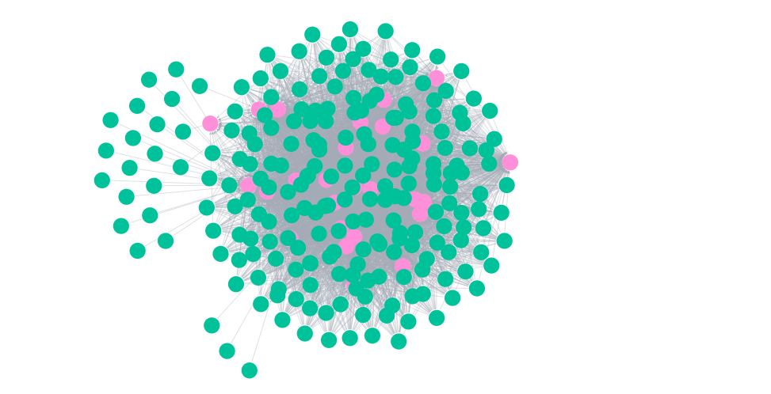
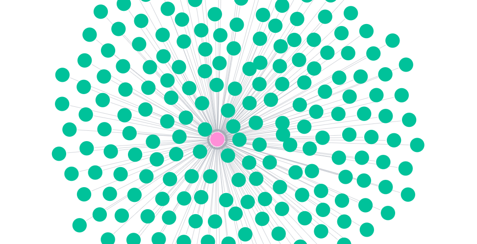
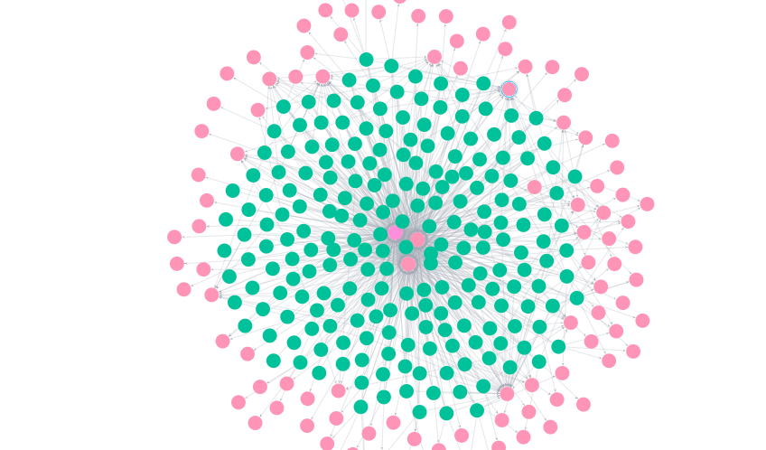

+++
title =  "Neo4J: Supreme Court Explore"
description = "Exploring a Seeded Knoledge Graph"
tags = ['Java', "neo4j","databases"]
images = ["images/feature-image.png"]
date = "2024-08-08T15:10:02-05:00"
categories = ["projects"]
series = ["Java"]
+++

# Supreme Court Graph Explore

In the past few posts, I built a knowledge graph based on some metadata. It was an enjoyable experience, but what is the real purpose behind it?

## Summary of Work So Far


### Build the Database first

I a proponent of building out an immutable source of truth prior to ingesting anything into a graph.  I have in the past built graphs for fun, but found that transforming in python then loading into memory prior to ingesting into neo was a painful and expensive exercise. [Check out this post for details about how to do that with PostGresql](https://jnapolitano.com/en/posts/sup-court-data-ingestion/)


### Ingest into Neo

Once a data model is in place, we can leverage SQL queries to create unique nodes and relationships. It is incredibly important to create a normalized database; otherwise, we'll generate runaway queries that will blow up your machine or your GCP bill. I ingested data in a few steps. Admittedly, I approached the problem somewhat naively at first to get a proof of concept built, then I refined it further. Here are the details:

1. [Node Ingestion Proof of Concept](https://jnapolitano.com/en/posts/supreme-court-to-postgres-to-neo/)
2. [Node Relation Proof of Concept](https://jnapolitano.com/en/posts/supreme-court-meta-relationships/)
3. [Unique Nodes and Relationsihps](https://jnapolitano.com/en/posts/supreme-court-transfer-service-uniques/)


## Exploring the Seeded Graph

With the graph seeded, I wanted to explore and visualize the existing relationships. I might create some more relationships to answer questions that come up as I go through the data.

## My Feelings on Graphs

Before I start the exploration, I want to share my thoughts on graphs. I think graphs are cool. They make me look like a data savant when I present a beautiful gravity model to an executive. That said, I do not like working with graphs as databases, data lakes, or data warehouses. I see graphs as tools to help understand relationships and (maybe) create new ones in a dataset. To work with them at scale, a robust data pipeline must be in place. Otherwise, the graph will become a mess of unattached nodes and nonsensical relationships.

## The Exploration

My graph relates item nodes (Supreme Court cases) to contributors and subjects (topics). I seeded the graph with about 6,000 nodes, so I expect many subjects to not relate back to nodes in the dataset. My first question is: which cases did contributors contribute to?

So my query translated into cypher is...

```sql
MATCH (i:Item) - [r:HAS_CONTRIBUTOR] - (c:Contributor)
return i,r,c
```



### SO What

Yeah this is cool... it reveals a gravity model showing a bunch of nodes that don't really answer any questions.. So which justice contributed to the most cases? 


#### Which Justice Contributed to the Most Cases

```sql
MATCH (i:Item)-[r:HAS_CONTRIBUTOR]-(c:Contributor)
WHERE c.contributor <> "supreme court of the united states"
RETURN c, COUNT(i) AS itemCount
ORDER BY itemCount DESC
LIMIT 1;
```


This will return the following node 

```json
<id>: 7790
contributor: "paterson, william"
```


#### Which Cases did the Justice Contribute To? 

So based on the limited information in my graph, Justice William Patterson contributed to the most cases. Which cases? 


```
MATCH (i:Item)-[r:HAS_CONTRIBUTOR]-(c:Contributor)
WHERE c.contributor = "paterson, william"
RETURN i,c,r, COUNT(i) as item_count

```




This returns 215 seperate items in my dataset.  I can export this information if I'd like get the titles. Here is a subset of that information 


```json
[
  {
    "i": {
      "identity": 7823,
      "labels": ["Item"],
      "properties": {
        "date": "17880000",
        "callNumber": "series: Volume 1",
        "externalId": "http://www.loc.gov/item/usrep001293/",
        "title": "U.S. Reports: Tetter v. Rapesnyder, 1 U.S. (1 Dall.) 293 (1788)."
      }
    },
    "c": {
      "identity": 7790,
      "labels": ["Contributor"],
      "properties": {
        "contributor": "paterson, william"
      }
    },
    "r": {
      "identity": 1177695700603903631,
      "start": 7823,
      "end": 7790,
      "type": "HAS_CONTRIBUTOR"
    },
    "item_count": 1
  },
  {
    "i": {
      "identity": 7824,
      "labels": ["Item"],
      "properties": {
        "date": "17880000",
        "callNumber": "series: Volume 1",
        "externalId": "http://www.loc.gov/item/usrep001305a/",
        "title": "U.S. Reports: Caldwell v. Barclay, 1 U.S. (1 Dall.) 305 (1788)."
      }
    },
    "c": {
      "identity": 7790,
      "labels": ["Contributor"],
      "properties": {
        "contributor": "paterson, william"
      }
    },
    "r": {
      "identity": 1177695700603903632,
      "start": 7824,
      "end": 7790,
      "type": "HAS_CONTRIBUTOR"
    },
    "item_count": 1
  },
  {
    "i": {
      "identity": 7829,
      "labels": ["Item"],
      "properties": {
        "date": "17840000",
        "callNumber": "series: Volume 1",
        "externalId": "http://www.loc.gov/item/usrep001081a/",
        "title": "U.S. Reports: Rivers v. Walker, 1 U.S. (1 Dall.) 81 (1784)."
      }
    },
    "c": {
      "identity": 7790,
      "labels": ["Contributor"],
      "properties": {
        "contributor": "paterson, william"
      }
    },
    "r": {
      "identity": 1177695700603903637,
      "start": 7829,
      "end": 7790,
      "type": "HAS_CONTRIBUTOR"
    },
    "item_count": 1
  }
]

```


#### Which subjects?

Next I really want to know which subjects Justice Patterson contributed to.  The query below permits that, but it returns a ton of information in a single view. 


```MATCH (i:Item)-[r:HAS_CONTRIBUTOR]-(c:Contributor)
WHERE c.contributor = "paterson, william"
OPTIONAL MATCH (i)-[s:HAS_SUBJECT]->(sub:Subject)
RETURN i, c, r,s, COUNT(i) AS item_count, COLLECT(sub) AS subjects
```




json subset

```json

[
  {
    "i": {
      "identity": 7823,
      "labels": [
        "Item"
      ],
      "properties": {
        "date": "17880000",
        "callNumber": "series: Volume 1",
        "externalId": "http://www.loc.gov/item/usrep001293/",
        "title": "U.S. Reports: Tetter v. Rapesnyder, 1 U.S. (1 Dall.) 293 (1788)."
      },
      "elementId": "4:97e89a5d-6db8-49a1-af67-ce21cfe39493:7823"
    },
    "c": {
      "identity": 7790,
      "labels": [
        "Contributor"
      ],
      "properties": {
        "contributor": "paterson, william"
      },
      "elementId": "4:97e89a5d-6db8-49a1-af67-ce21cfe39493:7790"
    },
    "r": {
      "identity": 1177695700603903631,
      "start": 7823,
      "end": 7790,
      "type": "HAS_CONTRIBUTOR",
      "properties": {},
      "elementId": "5:97e89a5d-6db8-49a1-af67-ce21cfe39493:1177695700603903631",
      "startNodeElementId": "4:97e89a5d-6db8-49a1-af67-ce21cfe39493:7823",
      "endNodeElementId": "4:97e89a5d-6db8-49a1-af67-ce21cfe39493:7790"
    },
    "s": {
      "identity": 1157433900327247503,
      "start": 7823,
      "end": 10458,
      "type": "HAS_SUBJECT",
      "properties": {},
      "elementId": "5:97e89a5d-6db8-49a1-af67-ce21cfe39493:1157433900327247503",
      "startNodeElementId": "4:97e89a5d-6db8-49a1-af67-ce21cfe39493:7823",
      "endNodeElementId": "4:97e89a5d-6db8-49a1-af67-ce21cfe39493:10458"
    },
    "item_count": 1,
    "subjects": [
      {
        "identity": 10458,
        "labels": [
          "Subject"
        ],
        "properties": {
          "subject": "periodical"
        },
        "elementId": "4:97e89a5d-6db8-49a1-af67-ce21cfe39493:10458"
      }
    ]
  },
  {
    "i": {
      "identity": 7823,
      "labels": [
        "Item"
      ],
      "properties": {
        "date": "17880000",
        "callNumber": "series: Volume 1",
        "externalId": "http://www.loc.gov/item/usrep001293/",
        "title": "U.S. Reports: Tetter v. Rapesnyder, 1 U.S. (1 Dall.) 293 (1788)."
      },
      "elementId": "4:97e89a5d-6db8-49a1-af67-ce21cfe39493:7823"
    },
    "c": {
      "identity": 7790,
      "labels": [
        "Contributor"
      ],
      "properties": {
        "contributor": "paterson, william"
      },
      "elementId": "4:97e89a5d-6db8-49a1-af67-ce21cfe39493:7790"
    },
    "r": {
      "identity": 1177695700603903631,
      "start": 7823,
      "end": 7790,
      "type": "HAS_CONTRIBUTOR",
      "properties": {},
      "elementId": "5:97e89a5d-6db8-49a1-af67-ce21cfe39493:1177695700603903631",
      "startNodeElementId": "4:97e89a5d-6db8-49a1-af67-ce21cfe39493:7823",
      "endNodeElementId": "4:97e89a5d-6db8-49a1-af67-ce21cfe39493:7790"
    },
    "s": {
      "identity": 1155182100513562255,
      "start": 7823,
      "end": 10660,
      "type": "HAS_SUBJECT",
      "properties": {},
      "elementId": "5:97e89a5d-6db8-49a1-af67-ce21cfe39493:1155182100513562255",
      "startNodeElementId": "4:97e89a5d-6db8-49a1-af67-ce21cfe39493:7823",
      "endNodeElementId": "4:97e89a5d-6db8-49a1-af67-ce21cfe39493:10660"
    },
    "item_count": 1,
    "subjects": [
      {
        "identity": 10660,
        "labels": [
          "Subject"
        ],
        "properties": {
          "subject": "ex parte"
        },
        "elementId": "4:97e89a5d-6db8-49a1-af67-ce21cfe39493:10660"
      }
    ]
  },
  {
    "i": {
      "identity": 7823,
      "labels": [
        "Item"
      ],
      "properties": {
        "date": "17880000",
        "callNumber": "series: Volume 1",
        "externalId": "http://www.loc.gov/item/usrep001293/",
        "title": "U.S. Reports: Tetter v. Rapesnyder, 1 U.S. (1 Dall.) 293 (1788)."
      },
      "elementId": "4:97e89a5d-6db8-49a1-af67-ce21cfe39493:7823"
    },
    "c": {
      "identity": 7790,
      "labels": [
        "Contributor"
      ],
      "properties": {
        "contributor": "paterson, william"
      },
      "elementId": "4:97e89a5d-6db8-49a1-af67-ce21cfe39493:7790"
    },
    "r": {
      "identity": 1177695700603903631,
      "start": 7823,
      "end": 7790,
      "type": "HAS_CONTRIBUTOR",
      "properties": {},
      "elementId": "5:97e89a5d-6db8-49a1-af67-ce21cfe39493:1177695700603903631",
      "startNodeElementId": "4:97e89a5d-6db8-49a1-af67-ce21cfe39493:7823",
      "endNodeElementId": "4:97e89a5d-6db8-49a1-af67-ce21cfe39493:7790"
    },
    "s": {
      "identity": 1152930300699877007,
      "start": 7823,
      "end": 12665,
      "type": "HAS_SUBJECT",
      "properties": {},
      "elementId": "5:97e89a5d-6db8-49a1-af67-ce21cfe39493:1152930300699877007",
      "startNodeElementId": "4:97e89a5d-6db8-49a1-af67-ce21cfe39493:7823",
      "endNodeElementId": "4:97e89a5d-6db8-49a1-af67-ce21cfe39493:12665"
    },
    "item_count": 1,
    "subjects": [
      {
        "identity": 12665,
        "labels": [
          "Subject"
        ],
        "properties": {
          "subject": "court decisions"
        },
        "elementId": "4:97e89a5d-6db8-49a1-af67-ce21cfe39493:12665"
      }
    ]
  },
  {
    "i": {
      "identity": 7824,
      "labels": [
        "Item"
      ],
      "properties": {
        "date": "17880000",
        "callNumber": "series: Volume 1",
        "externalId": "http://www.loc.gov/item/usrep001305a/",
        "title": "U.S. Reports: Caldwell v. Barclay, 1 U.S. (1 Dall.) 305 (1788)."
      },
      "elementId": "4:97e89a5d-6db8-49a1-af67-ce21cfe39493:7824"
    },
    "c": {
      "identity": 7790,
      "labels": [
        "Contributor"
      ],
      "properties": {
        "contributor": "paterson, william"
      },
      "elementId": "4:97e89a5d-6db8-49a1-af67-ce21cfe39493:7790"
    },
    "r": {
      "identity": 1177695700603903632,
      "start": 7824,
      "end": 7790,
      "type": "HAS_CONTRIBUTOR",
      "properties": {},
      "elementId": "5:97e89a5d-6db8-49a1-af67-ce21cfe39493:1177695700603903632",
      "startNodeElementId": "4:97e89a5d-6db8-49a1-af67-ce21cfe39493:7824",
      "endNodeElementId": "4:97e89a5d-6db8-49a1-af67-ce21cfe39493:7790"
    },
    "s": {
      "identity": 1159685700140932752,
      "start": 7824,
      "end": 9573,
      "type": "HAS_SUBJECT",
      "properties": {},
      "elementId": "5:97e89a5d-6db8-49a1-af67-ce21cfe39493:1159685700140932752",
      "startNodeElementId": "4:97e89a5d-6db8-49a1-af67-ce21cfe39493:7824",
      "endNodeElementId": "4:97e89a5d-6db8-49a1-af67-ce21cfe39493:9573"
    },
    "item_count": 1,
    "subjects": [
      {
        "identity": 9573,
        "labels": [
          "Subject"
        ],
        "properties": {
          "subject": "statutory construction"
        },
        "elementId": "4:97e89a5d-6db8-49a1-af67-ce21cfe39493:9573"
      }
    ]
  },
  {
    "i": {
      "identity": 7824,
      "labels": [
        "Item"
      ],
      "properties": {
        "date": "17880000",
        "callNumber": "series: Volume 1",
        "externalId": "http://www.loc.gov/item/usrep001305a/",
        "title": "U.S. Reports: Caldwell v. Barclay, 1 U.S. (1 Dall.) 305 (1788)."
      },
      "elementId": "4:97e89a5d-6db8-49a1-af67-ce21cfe39493:7824"
    },
    "c": {
      "identity": 7790,
      "labels": [
        "Contributor"
      ],
      "properties": {
        "contributor": "paterson, william"
      },
      "elementId": "4:97e89a5d-6db8-49a1-af67-ce21cfe39493:7790"
    },
    "r": {
      "identity": 1177695700603903632,
      "start": 7824,
      "end": 7790,
      "type": "HAS_CONTRIBUTOR",
      "properties": {},
      "elementId": "5:97e89a5d-6db8-49a1-af67-ce21cfe39493:1177695700603903632",
      "startNodeElementId": "4:97e89a5d-6db8-49a1-af67-ce21cfe39493:7824",
      "endNodeElementId": "4:97e89a5d-6db8-49a1-af67-ce21cfe39493:7790"
    },
    "s": {
      "identity": 1157433900327247504,
      "start": 7824,
      "end": 10458,
      "type": "HAS_SUBJECT",
      "properties": {},
      "elementId": "5:97e89a5d-6db8-49a1-af67-ce21cfe39493:1157433900327247504",
      "startNodeElementId": "4:97e89a5d-6db8-49a1-af67-ce21cfe39493:7824",
      "endNodeElementId": "4:97e89a5d-6db8-49a1-af67-ce21cfe39493:10458"
    },
    "item_count": 1,
    "subjects": [
      {
        "identity": 10458,
        "labels": [
          "Subject"
        ],
        "properties": {
          "subject": "periodical"
        },
        "elementId": "4:97e89a5d-6db8-49a1-af67-ce21cfe39493:10458"
      }
    ]
  }
]
```


#### Just Subjects? 

What I really want to know is which topics did Justice Williams focus on during his tenure at the court? 

The query below will return just those subjects.

```MATCH (i:Item)-[r:HAS_CONTRIBUTOR]-(c:Contributor)
WHERE c.contributor = "paterson, william"
OPTIONAL MATCH (i)-[s:HAS_SUBJECT]->(sub:Subject)
RETURN c,s, COUNT(i) AS item_count, COLLECT(sub) AS subjects

```

Note that there are no connections in this graph.. In order to get here the intermediary queries are necessary. As in there is not a direct relationsihp defined... yet.  


```json 

[
  {
    "c": {
      "identity": 7790,
      "labels": [
        "Contributor"
      ],
      "properties": {
        "contributor": "paterson, william"
      },
      "elementId": "4:97e89a5d-6db8-49a1-af67-ce21cfe39493:7790"
    },
    "s": {
      "identity": 1157433900327247503,
      "start": 7823,
      "end": 10458,
      "type": "HAS_SUBJECT",
      "properties": {},
      "elementId": "5:97e89a5d-6db8-49a1-af67-ce21cfe39493:1157433900327247503",
      "startNodeElementId": "4:97e89a5d-6db8-49a1-af67-ce21cfe39493:7823",
      "endNodeElementId": "4:97e89a5d-6db8-49a1-af67-ce21cfe39493:10458"
    },
    "item_count": 1,
    "subjects": [
      {
        "identity": 10458,
        "labels": [
          "Subject"
        ],
        "properties": {
          "subject": "periodical"
        },
        "elementId": "4:97e89a5d-6db8-49a1-af67-ce21cfe39493:10458"
      }
    ]
  },
  {
    "c": {
      "identity": 7790,
      "labels": [
        "Contributor"
      ],
      "properties": {
        "contributor": "paterson, william"
      },
      "elementId": "4:97e89a5d-6db8-49a1-af67-ce21cfe39493:7790"
    },
    "s": {
      "identity": 1155182100513562255,
      "start": 7823,
      "end": 10660,
      "type": "HAS_SUBJECT",
      "properties": {},
      "elementId": "5:97e89a5d-6db8-49a1-af67-ce21cfe39493:1155182100513562255",
      "startNodeElementId": "4:97e89a5d-6db8-49a1-af67-ce21cfe39493:7823",
      "endNodeElementId": "4:97e89a5d-6db8-49a1-af67-ce21cfe39493:10660"
    },
    "item_count": 1,
    "subjects": [
      {
        "identity": 10660,
        "labels": [
          "Subject"
        ],
        "properties": {
          "subject": "ex parte"
        },
        "elementId": "4:97e89a5d-6db8-49a1-af67-ce21cfe39493:10660"
      }
    ]
  },
  {
    "c": {
      "identity": 7790,
      "labels": [
        "Contributor"
      ],
      "properties": {
        "contributor": "paterson, william"
      },
      "elementId": "4:97e89a5d-6db8-49a1-af67-ce21cfe39493:7790"
    },
    "s": {
      "identity": 1152930300699877007,
      "start": 7823,
      "end": 12665,
      "type": "HAS_SUBJECT",
      "properties": {},
      "elementId": "5:97e89a5d-6db8-49a1-af67-ce21cfe39493:1152930300699877007",
      "startNodeElementId": "4:97e89a5d-6db8-49a1-af67-ce21cfe39493:7823",
      "endNodeElementId": "4:97e89a5d-6db8-49a1-af67-ce21cfe39493:12665"
    },
    "item_count": 1,
    "subjects": [
      {
        "identity": 12665,
        "labels": [
          "Subject"
        ],
        "properties": {
          "subject": "court decisions"
        },
        "elementId": "4:97e89a5d-6db8-49a1-af67-ce21cfe39493:12665"
      }
    ]
  },
  {
    "c": {
      "identity": 7790,
      "labels": [
        "Contributor"
      ],
      "properties": {
        "contributor": "paterson, william"
      },
      "elementId": "4:97e89a5d-6db8-49a1-af67-ce21cfe39493:7790"
    },
    "s": {
      "identity": 1159685700140932752,
      "start": 7824,
      "end": 9573,
      "type": "HAS_SUBJECT",
      "properties": {},
      "elementId": "5:97e89a5d-6db8-49a1-af67-ce21cfe39493:1159685700140932752",
      "startNodeElementId": "4:97e89a5d-6db8-49a1-af67-ce21cfe39493:7824",
      "endNodeElementId": "4:97e89a5d-6db8-49a1-af67-ce21cfe39493:9573"
    },
    "item_count": 1,
    "subjects": [
      {
        "identity": 9573,
        "labels": [
          "Subject"
        ],
        "properties": {
          "subject": "statutory construction"
        },
        "elementId": "4:97e89a5d-6db8-49a1-af67-ce21cfe39493:9573"
      }
    ]
  },
  {
    "c": {
      "identity": 7790,
      "labels": [
        "Contributor"
      ],
      "properties": {
        "contributor": "paterson, william"
      },
      "elementId": "4:97e89a5d-6db8-49a1-af67-ce21cfe39493:7790"
    },
    "s": {
      "identity": 1157433900327247504,
      "start": 7824,
      "end": 10458,
      "type": "HAS_SUBJECT",
      "properties": {},
      "elementId": "5:97e89a5d-6db8-49a1-af67-ce21cfe39493:1157433900327247504",
      "startNodeElementId": "4:97e89a5d-6db8-49a1-af67-ce21cfe39493:7824",
      "endNodeElementId": "4:97e89a5d-6db8-49a1-af67-ce21cfe39493:10458"
    },
    "item_count": 1,
    "subjects": [
      {
        "identity": 10458,
        "labels": [
          "Subject"
        ],
        "properties": {
          "subject": "periodical"
        },
        "elementId": "4:97e89a5d-6db8-49a1-af67-ce21cfe39493:10458"
      }
    ]
  }
]
```

#### Creating a New Relationship

So at this point I could generalize these queries to create relationships between authors and subjects directly. 

This query would return all of the contributor subject values. 

```sql

MATCH (i:Item)-[r:HAS_CONTRIBUTOR]-(c:Contributor)
WHERE c.contributor <> "supreme court of the united states"
OPTIONAL MATCH (i)-[s:HAS_SUBJECT]->(sub:Subject)
RETURN c,s, COUNT(i) AS item_count, COLLECT(sub) AS subjects

```

This query would create relationships... but I am not going to run that in the NeoGraph. I want to version control this to make it part of a workflow.  I'll detail that next. 


```sql 

MATCH (i:Item)-[r:HAS_CONTRIBUTOR]-(c:Contributor)
WHERE c.contributor <> "supreme court of the united states"
OPTIONAL MATCH (i)-[s:HAS_SUBJECT]->(sub:Subject)
WITH c, sub, COUNT(i) AS item_count, COLLECT(sub) AS subjects
WHERE sub IS NOT NULL
MERGE (c)-[:WROTE_ABOUT]->(sub)
RETURN c, item_count, subjects;

```


## Further Questions

So I want to know more.. I need to seed the graph. This will come after expanding my infrastrucutre. 

1. I want to know which parties were subject to the case
2. I want to know the justices' sentiment towards the case
3. I want to know the justices' political parties
4. I want to know the justices' sentiment towards precedent
5. I want to know the justices' values
6. I want to know the justices' attitudes towards legal doctrines
7. I want to know which cases justices' cited
8. I want to know which clause of the constitution was examined
9. I want to know which legislation was argued. 
10. I want to know which issues a justice covered and their sentiment towards them